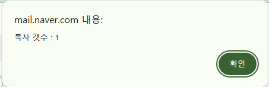
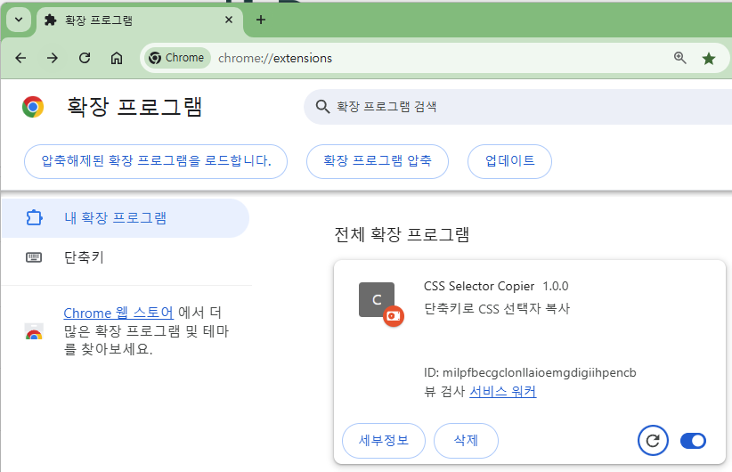

# 설치

* 주소창 `chrome://extensions/`
* 개발자모드 켜기  
  
* "압축해제된 확장 프로그램을 로드합니다." 클릭
* "manifest.json" 파일이 있는 폴더 경로 선택
* 설치 끝

## 실행

* `Ctrl+Shift+Y` : 사이트 접속시 한번 만 실행 하면 유지됨.
* 화면의 복사할 대상에 마우스 커서를 위치하고 `Ctrl+B`
* 셀렉터는 클립보드에 복사됨
* alt내용은 셀렉터 기준으로 갯 수 표시  


## 디버그 확인

* "F12" 개발자도구 열기
* "Console" 탭 선택
* `Ctrl+Shift+Y` ==> 콘솔 메세지 "Ctrl+Shift+Y 단축키가 눌렸습니다."
* 페이지 이동시 실행 상태는 유지됨.

## 복사

복사대상 **브라우저 창이 활성화** 되어 있어야 함

## 실행키 변경

* 주소창 `chrome://extensions/shortcuts`
* 연필 누르고 변경  


## 셀렉터 복사 단축키 변경

* `service-worker.js` 파일 수정  

* 단축키 문자열 `ctrlKey` `altKey` `shiftKey`

### 예제) `B` 키 변경

```javascript
// 원하는 단축키 설정
if (event.key === 'b')
```

### 수정 후 확인

* service-worker.js 수정시 확장프로그램 새로고침 필요
* 오른쪽 하단 새로고침 클릭

